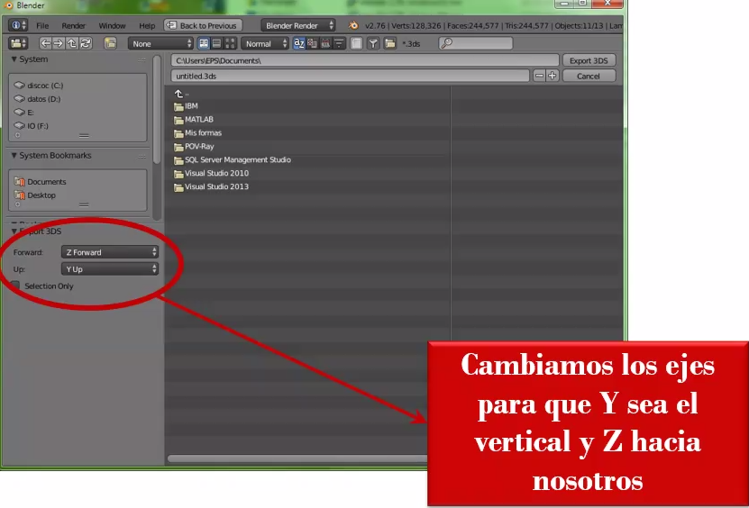

# Exportar los elementos



Hay que cambiar hacia donde se exportan los elementos y que no salgan invertidos. 

## Importar los elementos

Para importar el coche nosotros haremos un switch con cada uno de los casos para cada elemento, entonces así podemos mover las cosas de manera conjunta aunque el modelo sea diferentes archivos.

```c++
case COCHE_ID: { // Creación del coche
tx = -2.0;
ty = 0.0;
tz = 0.0;
rr = 0.0;
memcpy(colores, coloresc_c, 8*sizeof(float));
//************************ Cargar modelos 3ds *********************
// formato 8 floats por vértice (x, y, z, A, B, C, u, v)
modelo0 = Load3DS("../../Modelos/FordF250.3ds", &num_vertices0);
modelo1 = Load3DS("../../Modelos/RuedaFord.3ds", &num_vertices1);
break;
}

```

## Vertex Shader

Muy similar al previo, solo han cambiado algunas pocas cosas

```glsl
attribute vec4 a_Position; // in: Posición de cada vértice
attribute vec3 a_Normal; // in: Normal de cada vértice

uniform mat4 u_ProjectionMatrix; // in: Matriz Projection
uniform mat4 u_MVMatrix; // in: Matriz ModelView
uniform mat4 u_VMatrix; // in: Matriz View (cámara)
uniform vec4 u_Color; // in: Color del objeto
uniform int u_Luz0; // in: Indica si la luz 0 está encendida

varying vec4 v_Color; // out: Color al fragment shader

void main()
{
    vec3 LightPos = u_VMatrix*vec4(-7, 10, 9, 1);// Posición de la luz [fija]
    vec3 P = vec3(u_MVMatrix * a_Position); // Posición del vértice
    vec3 N = vec3(u_MVMatrix * vec4(a_Normal, 0.0));// Normal del vértice
    
    float d = length(LightPos.xyz - P); // distancia de la luz
    vec3 L = normalize(LightPos.xyz - P); // Vector Luz
    
    float ambient = 0.15; // (15% de int. ambiente)
    float diffuse = 0.0;
    if (u_Luz_0>0) { // Cálculo de la int. difusa si luz 0 encendida. Es 0 o 1 si hay luz o no. Podríamos poner luz==1
        diffuse = max(dot(N, L), 0.0);
        // Cálculo de la atenuación
        float attenuation = 1.0/(0.25+(0.01*d)+(0.003*d*d));
        diffuse = diffuse*attenuation;
    }
    v_Color = u_Color * (ambient + diffuse);
    gl_Position = u_ProjectionMatrix * vec4(P, 1.0);
}

```

