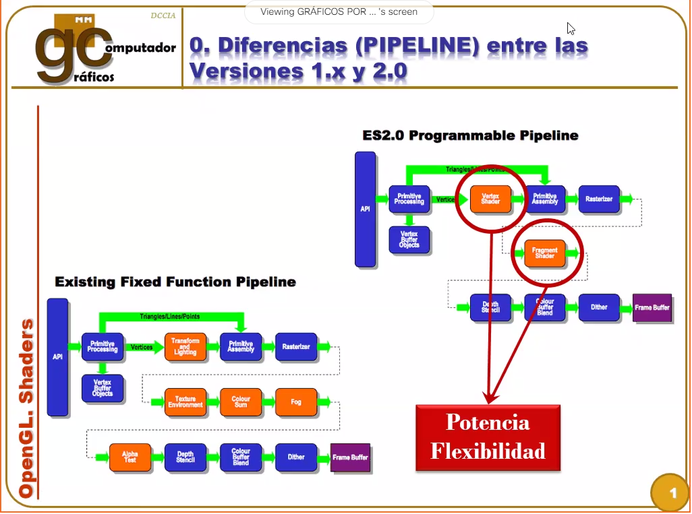
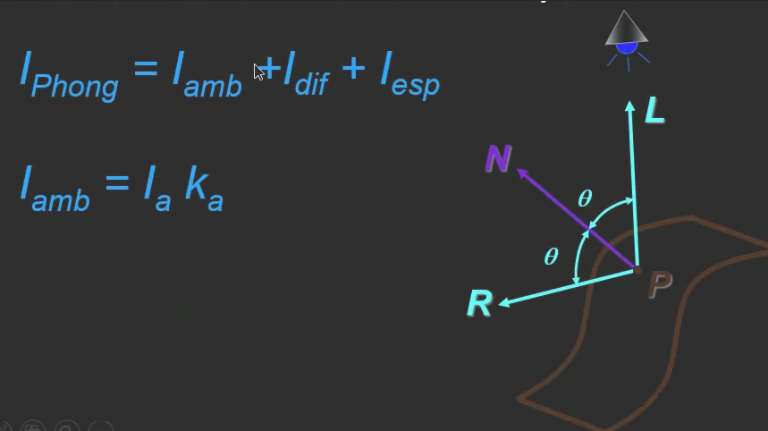
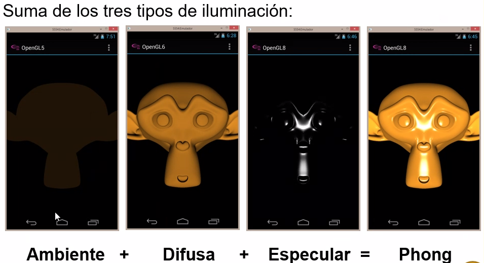

# OpenGL Shaders



Pipeline antiguo vs pipeline moderno. Antes era el pipeline de funciones fijas. Estaba limitado. A partir de la versión de OpenGL 2.0 por cada vértice se ejecuta un código que varia el color, y luego con el Fragment Shader escribimos como se van a mostrar los grupos de píxeles.

### Pasos:

1. Procesar la primitiva: Hacer el modelo en vértices, lineas y triángulos...
2. Se ejecuta la primitiva, si es el vértice se hace una vez, si es un triangulo 3...
3. Ensamblar la primitiva, crear todos los píxeles que se hacen uniendo los vértices.
4. Se rasteriza o rellena la primitiva.
5. Se pasa el Fragment Shader que cogera y pintará los píxeles.

Para programar en OpenGl tenemos dos tipos de código: **El programa en c++ donde se hace la funcionalidad** y el **programa de shaders** que utiliza con una sintaxis similar a la de C y la de Java. 

Como estamos gestionando los datos en un entorno 3D tenemos que gestionar tipos de datos en 3D. Por ejemplo son vectores de 2 a 4 elementos, o matrices de el mismo números. Normalmente trabajaremos con **matrices de 4x4**, esto se utiliza para operaciones de translación que son más cómodas. Hay tanto matrices de floats como matrices de doubles.

A la hora de trabajar con los tipos de datos, glsl permite trabajar con vectores con asignaciones directas, en lugar de tener que escribir todo a mano. 

```glsl
vec3 foo = vec3(1.0);
vec3 bar = vec3(foo);
vec4 baz = vec4(1.0, 2.0, 3.0, 4.0);
vec4 bat = vec4(1.0, foo); 
```

Y se pueden acceder a los elementos de esta manera:

```glsl
vec4 foo;
float x = foo[0];
float y = foo[1];
float z = foo[2];
float w = foo[3];
```

Los vectores se pueden asignar utilizando la notación **swizzling** que permite acceder a los componentes directamente.

```glsl
vec4 someVec;
someVec.x + someVec.y;

vec2 someVec;
vec4 otherVec = someVec.xyxx;
vec3 thirdVec = otherVec;

vec4 someVec;
someVec.wzyx = vec4(1.0, 2.0, 3.0, 4.0); // Invertimos
```

Los componentes de los vectores4 se pueden llamar de esta manera:

```glsl
typedef union vec4_t{
    struct{
        float x;
        float y;
        float z;
        float w;
    };
    struct{
        float s;
        float t;
        float p;
        float q;
    };
    struct{
        float r;
        float g;
        float b;
        float a;
    };
        
}vec4;
```


También podemos declarar vectores como en C, pero nos interesa hacerlo con los valores de glsl porque nos permiten hacer copiar y pegar.

```glsl
float a[10];
float b[a.length()];
mat4 c;
float d = float(c.length()); // con el mat4 podemos acceder a los tamaños directamente. d es 4.
int e = c[0].length();

int i;

for(i = 0; i < a.length(); i++){
    b[i] = a[i]
}
```


## Tipos de Shader

1. **Vertex Shader**: Se ejecuta una vez por cada vértice. **Una vez por vértice de la primitiva**. También hay primitivas optimizadas, por ejemplo si tenemos una tira de triángulos podemos reutilizar vertices uniendolos para hacer triángulos 
2. **Fragment Shader**: Una vez por píxel (o grupo de píxeles).
3. **Geometry Shader**: Nos permite crear geometría en tiempo real, nosotros no lo usaremos.
4. Otros tipos de shader.

**Ejercicio**: Buscar que otros tipos de *shaders* existen, aparte del **vertex** y del **fragment**.


## Palabras clave

**In**: Podemos crear nuestras propias, pero estas son las más usuales.

1. **gl_Vertex**: Coordenadas del vertice.
2. **gl_Color**: contiene el color definido desde la aplicación con glColor. Accesible desde el Vertex Shader.
3. **gl_Normal**: Normales de lso vertices. Accesible desde el Vertex Shader.
4. **gl_MultiTexCoord0**: contiene las coordenadas de textura.

**Out**: Estas son las dos variables obligatorias para que funcione el programa. Ya que tenemos que saber la posición de los vértices y el color de los píxeles.

1. **gl_Position**: Posicion de los shaders.
2. **gl_FragColor**: Color de cada uno de los píxeles.

**Grupos de variabels de shaders**:

1. **Unifiorm:** Variables de entrada de la aplicación y que se van a comportar como constante en el **rendering**. Pero **entre frame y frame** se puede cambiar el Uniform. 
2. **varying:** Variables que **se pasan** **exclusivamente** del **vertex shader al fragment shader**. Nos permite definir propiedades por vértice que luego se extienden a los píxeles. Se <u>interpolan de manera automática</u> por la GPU. Si vamos a dibujar una línea con dos colores, V1 = verde y V2 = rojo, el fragment shader interpolará el cambio de color durante la línea. Por ejemplo para dar la sensación de profundidad en una esfera  tenemos que poner valores más claros y oscuros. Esto lo hace el Varying.
3. **attribute:** Parecidos a los **Uniform**, variables de entrada pero que se presentan como vectores y que se pueden procesar y variar durante la ejecución. Los atributos típicos son lso que hemos dicho antes, como *gl_Vertex*, *gl:_Normal* o *gl_Color* 


# Ejemplos de Shaders:

Vertex shader:

```glsl
// Matriz que hace de 3D a 2D para poder imprimirlo en la pantalla. 
uniform mat4 mvp; // model view projection

varying vec3 pixel_color; // enviar al pixel shader el color

void main(){
    pixel_color = gl_Color.xyz; // Enviamos el color de cada vértice al fragment shader
    gl_Position = mvp * gl_Vertex; // transformamos el vértice a screen space
}
```

Fragment Shader:

```glsl
varying vec3 pixel_color; //aquí viene el color interpolado
void main()
{
	gl_FragColor = vec4(pixel_color,1); //ponemos el color en el píxel
}
```


# Funciones matemáticas

```glsl
float radians(float degrees);
vec2 radians(vec2 degrees);
// etc. Mirar diapositiva 14 OpenGL.Shaders.pdf

// Importante:
float clamp(float x, float minVal, float maxVal); // redondea el valor entre dos valores
normalize(); // Normalizar el tamaño del vector
dot(); // Producto escalar
reflect(); 
```


# Nuestros shaders

En los shaders que vamos a usar en la práctica se implementa el modelo de Phong.



**Iamb** es la iluminación ambiente, la que esta en general. Se representa por **Ia * Ka**

**Idif** sigue la iluminacion de lambert, que es que si le llega un rayo, será reflejado en el mismo angulo. Esto se pude sacar sabiendo la normal. Hacemos el angulo entre ambos, y con el coseno podemos saber el grado de luz que quiere dar.

**Iesp** es la iluminación que funciona con el brillo. Saber las partes más reflectantes, es decir las que tienen menos angulo entre la cámara y la luz reflejada.



## Variables del shader:

```glsl
// Recomienda seguir esta sintaxis. u_ para uniform, a_ para attribute y v_ para varying
// así nos quitamos el problema de que el color del uniform y el del varying se tengan que llamar 
// color 1 y color 2

uniform mat4 u_MVPMatrix; // in: Matriz Projection*ModelView 2D
uniform mat4 u_MVMatrix; // in: Matriz ModelView 3D
uniform vec4 u_Color; // in: color del objeto

attribute vec4 a_Position; // in: Posición de cada vértice
attribute vec3 a_Normal; // in: Normal de cada vértice

varying vec4 v_Color; // out: Color al fragment shad
```


## Vertex shader

```glsl
void main()
{
    vec3 LightPos = vec3(0, 100, -70); // Posición de la luz [fija]
   	// En la práctica queremos que se pueda mover la luz, ahora misma es estática 
   
    vec3 P = vec3(u_MVMatrix * a_Position); // Posición del vértice
    // Para cada uno de los vertices, nos va a llegar la posicion y nosotros la multiplicamos, lo movemos, segun la posición de la cámara. El producto entre dos matrices se puede hacer en glsl con solamente una multiplicación normal.
    
    vec3 N = vec3(u_MVMatrix * vec4(a_Normal, 0.0));// Normal del vértice
    // A la normal le tenemos que añadir un valor más al final, ya que para multiplicar una matriz 4x4 con un vec3 tenemos que añadir un componente al final.
    
    float d = length(LightPos - P); // distancia de la luz OPTIMIZADA EN LA TARJETA GRÁFICA
    vec3 L = normalize(LightPos - P);  // Vector Luz
    								// (15% de int. ambiente)
    
    float diffuse = max(dot(N, L), 0.15); // Cálculo de la int. difusa
    // si miramos en el dibujo de arriba, estamos multiplicando con el producto escalar de la normal N y la luz L normalizados. Este producto escalar nos devuelve el coseno, un número entre 0 y 1. Utilizamos la funcion max para que ningun valor sea menor que 0.15, ya que se vería demasiado oscuro.
    
    // Cálculo de la atenuación
    float attenuation = 1.0/(0.3+(0.1*d)+(0.01*d*d)); 
    // Funcion que utilizamos para que segun la distancia disminuya el la iluminacion
    // d^2 es mas lento que d*d
    
    diffuse = diffuse*attenuation;
    
    v_Color = u_Color * diffuse; // Esto es un varying que va a ir al fragment shader, para controlar la luz que le llega y no se vea todo estático con el mismo color. Esto será interpolado solo más adelante.
    
    gl_Position = u_MVPMatrix * a_Position; // LINEA OBLIGATORIA
    // Esto mueve la posicion de los vértices a 2D.
}

```

Para crear nosotros más luces, tendremos que sumar acada una de las luces en el vertex shader.


## Fragment Shader

```glsl
precision mediump float; // Precisión media

varying vec4 v_Color; // in: color del vertex shader
// LLAMAR IGUAL, para que llegue desde el Vertex shader. Sino dará error.

void main()
{
	gl_FragColor = v_Color; // El color de los píxeles que se recibe desde el vertex shader
}
	
```

